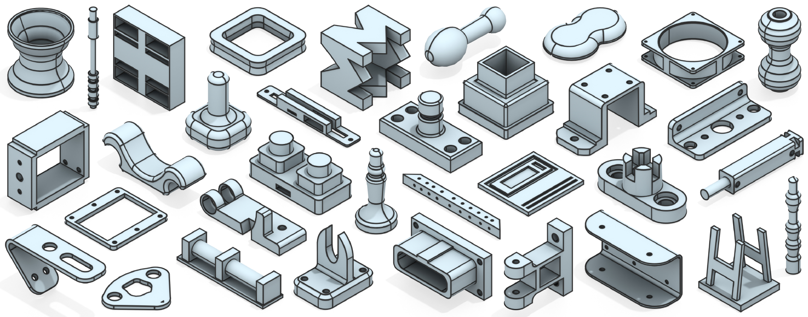

# FlowAR-BRep

**Interleaved Autoregression and Flow Matching for Single-Stage B-Rep Generation**

Yongkang Qi, Sunhong Qiu, Hao Pan, Haichuan Song · *SIGGRAPH Asia 2026*

[](assets/teaser.pdf)

FlowAR-BRep generates CAD boundary representations by interleaving autoregressive topology prediction with flow matching for geometry. This reference implementation supports unconditional generation and conditioning on point clouds, images, or text.

## Setup

Use Python 3.12 and run all commands from the repository root.

```bash
pip install -r requirements.txt
```

Install platform-specific dependencies separately: `pythonocc-core` for STEP preprocessing and CAD export, and PyTorch3D for point-cloud conditioning. FlashAttention is optional.

Convert your STEP files into training data:

```bash
python preprocess.py --input /path/to/steps --output data/npz --workers 8
```

This writes NPZ samples and `data/splits.json`, matching the paths in [`configs/train.yaml`](configs/train.yaml). See [data preparation](docs/data.md) for existing splits and conversion options. Pretrained weights are not included.

## Training

```bash
python train.py --config configs/train.yaml
```

Configuration examples are provided for [point clouds](configs/train_pointcloud.yaml), [images](configs/train_image.yaml), and [text](configs/train_text.yaml). The experimental [UV-grid configuration](configs/train_uvgrid.yaml) requires surface and edge VAE checkpoints.

<details>
<summary>Multi-GPU training</summary>

Set `--nproc_per_node` to the number of GPUs.

```bash
torchrun --standalone --nproc_per_node=4 train.py --config configs/train.yaml
```

</details>

## Generation

Supply a trained checkpoint to generate STEP files in `outputs/steps`:

```bash
python generate.py --config configs/generate.yaml --checkpoint weights/model.pt
```

Sampling and export options are defined in [`configs/generate.yaml`](configs/generate.yaml). Add `--save-png` for previews or `--save-npz` for reconstructed geometry arrays.

<details>
<summary>Generation with backtracking</summary>

For Bézier checkpoints, enable geometry checks and backtracking:

```bash
python generate.py --config configs/generate.yaml --checkpoint weights/model.pt \
  --use-geom-rejection
```

Add `--geom-check-intersect` to check curve intersections.

</details>

<details>
<summary>Conditional generation</summary>

Use a checkpoint trained for the corresponding input modality, together with its encoder assets. Conditional previews support Bézier checkpoints.

```bash
# Point cloud
python generate_conditioned.py --checkpoint weights/conditional.pt --pc-input data/input.ply

# Image
python generate_conditioned.py --checkpoint weights/conditional.pt --image-input data/input.png

# Text
python generate_conditioned.py --checkpoint weights/conditional.pt --caption-json data/captions.json
```

</details>

<details>
<summary>Multi-GPU generation</summary>

Set `--nproc_per_node` to the number of GPUs. During generation, each rank writes to its own output directory.

```bash
torchrun --standalone --nproc_per_node=4 generate.py --config configs/generate.yaml --checkpoint weights/model.pt
```

</details>

## Citation

```bibtex
@inproceedings{qi2026flowarbrep,
  title     = {{FlowAR-BRep}: Interleaved Autoregression and Flow Matching for Single-Stage {B-Rep} Generation},
  author    = {Qi, Yongkang and Qiu, Sunhong and Pan, Hao and Song, Haichuan},
  booktitle = {SIGGRAPH Asia 2026 Conference Papers},
  series    = {SA Conference Papers '26},
  year      = {2026},
  publisher = {Association for Computing Machinery},
  location  = {Kuala Lumpur, Malaysia},
  isbn      = {979-8-4007-2842-6},
  doi       = {10.1145/3829340.3842332},
  url       = {https://doi.org/10.1145/3829340.3842332}
}
```
